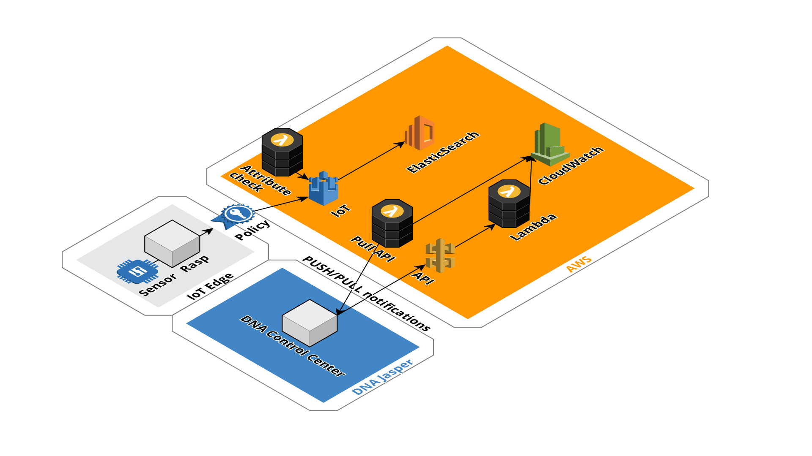

# DNA Control Center AWS connection

DNA offers connectivity for IoT devices to send data to cloud providers. DNA Control Center is tool that allows you to centrally manage your connectivity assets. AWS is leading cloud provider that has many services, including ones that help build IoT connected devices. 

With the following instructions we connect a device to AWS cloud by utilizing DNA connectivity and integrate DNA Control Center generated statistics and connectivity status to AWS services. The instructions are built so that with little customization different sensors, gateways or DNA Control Center statistics (different with the ones in this dmeo) can be taken into action.

System runs mostly in serverless fashion, only utilizing resources that are needed. Exception is Elasticsearch cluster that is running all the time and is used for data visualization.

## Table of content
1. AWS setup
2. Gateway setup (Raspberry Pi)
3. Visualization
4. DNA Control Center

## Prerequisite 

In order to build demo for yourselves you need the following
- AWS Account
- AWS CLI (https://docs.aws.amazon.com/cli/latest/userguide/installing.html)
- Git
- Gateway device (in demo Raspberry pi 3 model B+ is used)
- DNA connectivity
- Basic knowledge of python
- Sensor is optional (in demo we used DHT22 temperature sensor)

You should clone this repository and the following commands paths will work accordingly. 

## Architecture



At the end of this guide, you will have similar set up as the image above indicates. We will first set up the AWS side for the IoT data. Then we will set up the Raspberry Pi that acts as a gateway and starts sending messages by utilizing DNA Starter Kit. Last step is to attach the Jasper to AWS and monitor cellular device status within AWS. 

## AWS setup

AWS has basically five components that need to be configured for the IoT devices. 
- Thing. Thing is a description for the gateway, the thing that sends data to AWS
- Certificate and keys, that are used to create secure connection
- Policy that defines what the thing is allowed to do in the AWS 
- Topic. Stream that the thing send data to
- Topic rule. How the data coming in stream is handled at the AWS side

> None of the AWS cli commands have region defined. Set up default region in AWS configuration, so that the resources are created to the region you defined. 

### Create certificate and keys

Create a certificate and keys that secure the messaging between the thing and AWS cloud. We define the output file names as parameters. Here all the filenames start with dna_rasp. Store these files in safe place. We will need to transfer them to Raspberry later on. 

```bash
aws iot create-keys-and-certificate --set-as-active --certificate-pem-outfile dna_rasp.cert.pem --public-key-outfile dna_rasp.public.key --private-key-outfile dna_rasp.private.key
```

This command will return you the certificate arn. Store this, it will be needed later.

We also need AWS CA root certificate that needs to be stored on the Raspberry. This certificate can be loaded from here:
https://www.amazontrust.com/repository/AmazonRootCA1.pem

More information about the root certificate can be found here
https://docs.aws.amazon.com/iot/latest/developerguide/managing-device-certs.html

### Create thing

Next we will create thing. For this we need the certificate arn that was created above. You can define different name for the thing, but take that into consideration in steps after.

You can define atributes to the thing that attach the raspberry and sim card logically in the AWS IoT Core. This will help to find what sim is attached to what Raspberry. These are optional and can be left empty. 

```
aws cloudformation deploy --template-file thing/cloudformation/cf_thing.json --stack-name DNAThing --parameter-overrides IoTThingName=dna_rasp RaspMac=<MacAddressOfRasp> RaspIccid=<ICCID> CertificateArn=<certificateArn>  --capabilities CAPABILITY_NAMED_IAM
```

> You can edit the thing attributes later on and add or change the iccid. It can be done here, if know what SIM will be used for connectivity

### Create Elasticsearch and topic rule

Next we will start receiving data from the device to the AWS IoT core. Data will be delivered to specific topic and processed from there on. Incoming data is processed with topic rules. Topic rule gets the incoming message, checks if there is a iccid in the message and if not getes it from the thing attribute. This way, if you cannot change the gateway source code, you can manage for example iccid pairing at the IoT Core, with thing attributes.  There are multiple ways to handle the incoming data, but to visualize the data, we want to send directly to Elasticsearch. We do this by creating topic rule and at the same time Elasticsearch server. Both of these are done with CloudFormation stack, that sets up the infrastructure as code. Template for this can be found in cloudformation/cf_dna_jasper.json. This template requires parameters:

Parameter | Description | Default values
--- | --- | ---
elasticserachInstanceType | What is the size of the cluster. | t2.medium.elasticsearch
myIpAddress | Your ip address to access the kibana visualizations. String | - 
domainName | Domain to which the data will be saved. Change only if needed. | rasp

This command will create a stack with default parameters. Change the IP to one you have. You can check your IP from for example myip.com
```
aws cloudformation deploy --template-file elasticsearch/cloudformation/cf_dna_rasp.json --stack-name DnaElasticSearch --parameter-overrides myIpAddress=192.168.0.1 --capabilities CAPABILITY_NAMED_IAM
```

CloudFormation does not allow inserting multiple statements into policy. Therefore, we need to update the access policy to allow your specific IP to access the Kibana. If your IP changes you can run the following command. To do this, we simply re deploy the same stack with new template, that contains the missing policy parts. 

```
aws cloudformation deploy --template-file elasticsearch/cloudformation/cf_dna_rasp_bu.json --stack-name DnaElasticSearch --parameter-overrides myIpAddress=192.168.0.1 --capabilities CAPABILITY_NAMED_IAM
```

Command will give outputs about URLs to Elasticsearch and Kibana. Save these, as they are needed later on. You can test that Elasticsearch is set up ok by opening Kibana in your browser. You will do the next two steps in the Kibana console

```
aws cloudformation describe-stacks --stack-name DnaElasticSearch --query 'Stacks[0].Outputs[1].OutputValue' --output text
```

Elasticsearch comes with Kibana, which is the tool we are using to visualize the data. Access to Kibana is generated to specific IP defined in the CloudFormation stack. If your IP changes, easiest way to change the Elasticsearch policy document is from the console. Kibana access can be configured in other ways to allow easier access for wide range of audience, but are not done so in this demo. For more information see AWS documentation (https://docs.aws.amazon.com/elasticsearch-service/latest/developerguide/es-kibana.html)

> Elasticsearch is a distributed, RESTful search and analytics engine. It is well suited to store and analyze time series data, the one that is produced by the IoT devices. Kibana is analytics tool that lets you visualize your Elasticsearch data and navigate the Elastic Stack. AWS offers this stack as a service, that eases the set up of the cluster. We created the Elasticsearch cluster when we created the topic rule, since these are tight together. Now we will configure the Elasticsearch cluster. 

> Elasticsearch will generate costs all the time. By deleting the stack, the resources will be removed and stop cost generation as well.

#### Create index for time series data

IoT topic rule pushes the incoming data to Elasticsearch cluster as json. We need to define which one of the json element is time, so that we can visualize the timeseries data. We need to create a new index for this.

Run the following command in Kibana dev tools to create index named dna_rasp. 

```  
PUT /dna_rasp
{
  "mappings": {
    "temphum": { 
      "properties": { 
        "hum":          { "type": "float"  }, 
        "temp":         { "type": "float"  }, 
        "device_id":    { "type": "text" }, 
        "time":  {
          "type":   "date", 
          "format": "epoch_millis"
        }
      }
    }
  }
}
```

or substitute <elasticsearchUrl> with the one you received in the earlier step and run the curl command from command line. 

```
curl -X PUT "<elasticsearchUrl>:9200/dna_rasp" -H 'Content-Type: application/json' -d'
{
  "mappings": {
    "temphum": { 
      "properties": { 
        "hum":          { "type": "float"  }, 
        "temp":         { "type": "float"  }, 
        "device_id":    { "type": "text" }, 
        "time":  {
          "type":   "date", 
          "format": "epoch_millis"
        }
      }
    }
  }
}
'
```

> We created a index named dna_rasp. If you want to change this you also need to change the IoT topic rule that pushes the data, since it has been configured to push data to this index. You can change it by configuring the CloudFormation in 'Create Elasticsearch and topic' rule step.

#### Import dashboard

To visualize the data, we have ready-made dashboard that displays the temperature and humidity received from the sensors. 

Open Kibana, go to management -> saved objects -> import. Select dashboard from path elasticsearch/dashboards/export.json. You should now have new dashboard. Next, we will start pushing data to it using Raspberry Pi and DNA connectivity. 

### AWS IoT Endpoint

Last thing we need to know, before we can set up the gateway, in this case the Raspberry Pi, is the endpoint to which the data is send. This can be checked with the following command

```
aws iot describe-endpoint
```

## Gateway

In the demo we use Raspberry Pi 3 model B+. Raspberry is a small affordable computer that is a excellent choice for proof-of-concept IoT projects. For more information about the Raspberry Pi can be found here: https://www.raspberrypi.org/

Code that runs in the Raspberry Pi, does the following:
1. Connects to AWS IoT Core in secure fashion
2. Reads the data from sensor
3. Sends the data to AWS IoT Core
4. Waits 30 seconds and loops to step 2

Connectivity to AWS IoT Core is done with DNA Starter Kit.

### Setup

This demo assumes that you have set up the Raspberry Pi with the instructions found from Raspberry Pi webpage. 

Transfer the gateway folder to Raspberry Pi using scp.
``` 
scp /path/to/gateway pi@raspberrypi-local:~/gateway
```

> Raspberry Pi can run different OS, in this demo we use Raspbian. Regarding this demo, the OS should support running Python. Check that python is available and running version 2.7. If not, install python regarding your OS. `python --version`

Move the gateway folder and certificate, private key and root certificate to Raspberry Pi. They should be under same folder. Record the locations to config.ini file to match the ones you have. If you have used default values you only thing you need to change is the IoT endpoint.

Before we can run the sample code we need to install required libraries to python. You can do this with following commands. Requirements file is found under gateway folder. 
```
pip install virtualenv
python -m virtualenv -p python venv
source venv/bin/activate
pip install -r gateway/requirements.txt
```

Program has couple of parameters to help you get started. 

Parameter | Description | Values | Default
--- | --- | --- | ---
p | Pin number to which the sensor is attached | 2-26 | 2
r | Generate data. This can be used if no sensor is attached. Boolean type | t or f | f (false)
i | ICCID of the sim that is used for connectivity | 123456789 | 123456789
h | Help. |  | 

For example, if you want to run the program and send random generated data to AWS, run the following command
```
python mqtt_client.py -r t
```

You should now receive messages to AWS IoT Core and those messages are pushed to Elasticsearch. Data should be visible in Kibana.

> In this demo we pass the ICCID as parameter, since the Raspberry Pi is not set up to read connected SIM card ICCID. 

#### Note about the ICCID 

When we created a thing to AWS IoT Core, we added ICCID as attribute to thing. 

Two scenarios. If the gateway can read the ICCID and send it to data store, we will have the binding done at the data level and each message contains this information. 
If this is not possible, we can add the ICC

### Connect DHT22 sensor

In order to push real data, we need to connect sensor to the Raspberry Pi. We used DHT22 sensor that is simple temperature and humidity sensor. To get the IO pin information you can run ``` pinout ``` command in the terminal.

We need to connect the power to the 5v, ground to GND and IO pin to any of the GPIO pins. Just keep in mind witch pin you connected the sensor. When you run the program, pass the pin number as parameter (-p) and the program will read information from the sensor. 

For example, if the DHT22 is connected to pin number 2 and iccid of the sim is 76879096
``` 
python mqtt_client -p 2 -i 76879096
```

# DNA Control Center configuration

DNA Control Center is a connectivity management service, which allows you to monitor and analyse the usage of different connectivity. In order to make the usage even easier, we will integrate some of the key metrics to AWS. 

Integration can be done through DNA Control Center provided APIs. There are two types of APIs, pull and push. 

For more information about the DNA Control Center provided APIs, please refer to DNA Control Center documentation. 

## Push receiving API

In order to receive PUSH type messages from DNA Control Center, we need to create API in the AWS for this. We will use API Gateway to create the endpoint and handle the message parsing with Lambda. This can be created with CloudFormation.

Data received is parsed and stored to CloudWatch. CloudWatch is AWS monitoring service, that now receives and visualizes the DNA Control Center data. Different triggers can be applied to the metrics and for example alarms setup on the metrics.  

### Secure push type messages

Messages pushed from DNA Control Center can be secured by creating a shared secret. This shared secret can be used to check the signature at the receiving end to make sure that the data is coming from known source. 

Create shared secret in DNA Control Center. Admin > Account Profile > Edit button > Shared secret. Records the shared secret, we need it later. 

### Create API stack

Build the API endpoint and Lambda by creating the following stack. This stack creates a API Gateway that has lambda attached to it that handles the incoming messages to CloudWatch for monitoring.

First, we create a S3 bucket for the source codes. Give your bucket unique name, for example yourname-jasper-codes
``` 
aws cloudformation deploy --template-file api-gateway/cloudformation/source_code_bucket.json --stack-name DnaSourceCodeBucket --parameter-overrides BucketName=<NameYourBucket>
```

Package the lambda.zip that contains the lambda function that handles the incoming messages to your CloudFormation by running the following command
```
aws cloudformation package --template-file api-gateway/cloudformation/infra-swagger.yaml --s3-bucket <NameYourBucket> --output-template-file api-gateway/cloudformation/packaged-template.yaml
```

Now we can create a stack that creates the endpoint and lambda to handle the incoming messages. Change the <yourSecretKey> to the one you defined in DNA Control Center above.
```
aws cloudformation deploy --template-file api-gateway/cloudformation/packaged-template.yaml --stack-name DnaControlCenterAPI --capabilities CAPABILITY_IAM --parameter-overrides SecretKey=<yourSecretKey>
```

Check out the URL to which we will start sending DNA Control Center data by running command. 
```
aws cloudformation describe-stacks --stack-name DnaControlCenterAPI --output text --query 'Stacks[0].Outputs[0].OutputValue'
```

### Set automation rules in DNA Control Center to push data

API Gateway will now receive the messages coming from DNA Control Center. We now need to send the messages we want to receive by setting automation rules in DNA Control Center. We do this from the DNA Control Center, under automation. 
1. Select automation > actions > Create New. This will open a new window where we define what data will be send. 
2. Select Usage Monitoring > Recent Data Usage (24 hours). 
3. Set the Kb limit to 1, so that we will receive messages if any usage is happening 
4. Select Push api message option. For the URL set the one you received when creating the api and add `/api/DataUsage` to the end. Now the lambda will take care of these messages. 

Your URL should look something like
```
https://abcdefghijjk.execute-api.eu-west-1.amazonaws.com/api/DataUsage
```

To monitor the connection of the sims, do the following automation rule. 
1. Select automation > actions > Create New. This will open a new window where we define what data will be send. 
2. Select Usage Monitoring > No connection
3. Set the limit to 1, so that we will receive messages if no connection is detected
5. Select Push api message option. For the URL set the one you received when creating the api and add `api/NoConnection` to the end. Now the lambda will take care of these messages. 

### Monitor data usage from CloudWatch

Log into AWS console and look for service CloudWatch. Under Metrics you should now see custom metric called DnaControlCenterMetrics and under that dimension called ICCID. Here are the metrics for each ICCID SIM that can be monitored. 

#### Modify the API

If you want to create new endpoints and handle different types, you need to modify the lambda code. What you need to do is the following. 

1. Create new automation rule, that pushes the data to API. API endpoint is the one you created in AWS and path is up to you.
2. Create python function in lambda that will handle the incoming data. You can use request_proxy function to parse the XML data.
3. Build python code with pybuilder that generates zip file
4. Run the cloudformation update

Code resides in the folder api-gateway/src/main/python/proxy_handler.py. 
To build the source code run the following commands
```
pip install virtualenv
python -m virtualenv -p python venv
source venv/bin/activate
pip install pybuilder
pyb lambda package
```

Now you should have a new lambda.zip file that can be uploaded and deployed. If you have already deployed the lambda, you can leave out the parameters-overrides in the later command. 
```
aws cloudformation package --template-file api-gateway/cloudformation/infra-swagger.yaml --s3-bucket <NameYourBucket> --output-template-file api-gateway/cloudformation/packaged-template.yaml

aws cloudformation deploy --template-file api-gateway/cloudformation/packaged-template.yaml --stack-name DnaControlCenterAPI --capabilities CAPABILITY_IAM --parameter-overrides SecretKey=<yourSecretKey>
```

## Read data from DNA Control Center API

We can also pull data from DNA Control Center API. One way to do this, is to schedule lambda to request data from API. Here is an example Lambda that request data once every ten minutes from API endpoint and stores the data to CloudWatch log streams. Lambda polls all devices status.

Get API key from DNA Control Center help knowledge base under REST api section and records your username. Check that you have permissions to read API. You can do this by logging into DNA Control Center, select Admin and then users. Access type will should read similar to API.

```
aws cloudformation deploy --template-file api-poller/cloudformation/cf-apo-poller.json --stack-name DnaControlCenterAPIPoller --capabilities CAPABILITY_IAM --parameter-overrides ApiKey=<yourSecretKey> ApiUsername=<username>
```

This stack will set up lambda that will trigger once in ten minutes and write log to CloudWatch under DnaControlCenterLogGroup. You can check the records from the AWS Console. 

## Clean up

To clean up the demo from your AWS account delete the stacks that were created above. 

```
aws cloudformation delete-stack --stack-name DNAThing
aws cloudformation delete-stack --stack-name DnaElasticSearch
aws cloudformation delete-stack --stack-name DnaSourceCodeBucket
aws cloudformation delete-stack --stack-name DnaControlCenterAPI
aws cloudformation delete-stack --stack-name DnaControlCenterAPIPoller
```